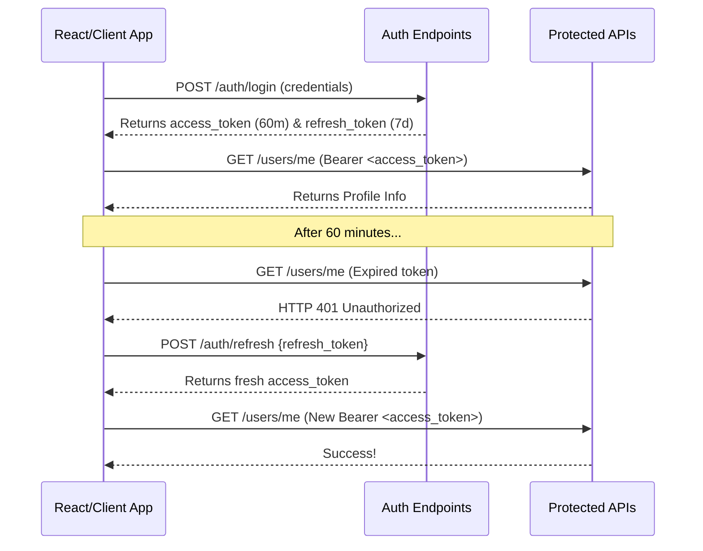
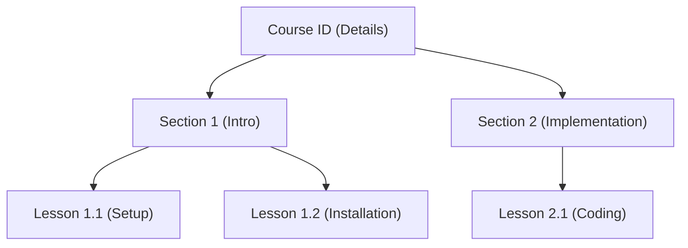

# LMS - Online Learning Platform Frontend Integration Guide

Welcome to the **LMS - Online Learning Platform** API integration specifications. This document contains all the crucial architectural details, payload structures, security procedures, and testing resources required to build a beautiful, premium, responsive client application that integrates out-of-the-box with this FastAPI & MongoDB backend.

---

## 🚀 1. Core Server Connection

*   **API Base URL**: `http://localhost:8000/api/v1`
*   **Static Asset Storage Base**: `http://localhost:8000/static/uploads/`
*   **Interactive OpenAPI / Swagger Documentation**: [http://localhost:8000/docs](http://localhost:8000/docs) (Live endpoint testing page)
*   **Alternate Redoc Interactive Specs**: [http://localhost:8000/redoc](http://localhost:8000/redoc)
*   **Postman Collection Asset**: Located at the project root as `postman_collection.json`. Simply import this file into Postman for categorized request folders, pre-configured authorization variables, and automated sandbox tokens!

---

## 🔒 2. Authentication & Authorization (JWT Security Architecture)

The platform secures endpoints using **Role-Based Access Control (RBAC)** across three specific user categories: `student`, `instructor`, and `admin`.

### A. Authentication Header Structure
For all protected routes, you must supply the JWT Access Token in the standard Bearer format:
```http
Authorization: Bearer <your_access_token>
```

### B. Access & Refresh Token Flow
*   **Access Token Lifetime**: `60 Minutes` (Used for API calls)
*   **Refresh Token Lifetime**: `7 Days` (Used to transparently generate a new access token without logging out the user)



---

## 🛠️ 3. Interactive Sandbox Simulators (Zero-Config Testing)

To keep development frictionless, the backend includes **Developer Simulators** that do not require third-party service sign-ups:

### ✉️ 1. Simulated OTP (Forgot Password Recovery)
*   **Endpoint**: `POST /api/v1/auth/forgot-password`
*   **Behavior**: When a user enters their email, the platform generates a 6-digit verification code.
*   **Integration Ease**: To bypass setting up SMTP servers, **the backend logs a beautifully stylized email template with the OTP directly in the terminal console and returns the OTP inside the response JSON!**
*   **Response Payload**:
    ```json
    {
      "success": true,
      "message": "OTP sent successfully (Simulated)",
      "otp": "123456"
    }
    ```

### 💳 2. Simulated Payments Engine (Razorpay Sandbox Bypass)
*   **Create Order**: `POST /api/v1/payments/create-order`
*   **Verify Signature**: `POST /api/v1/payments/verify-signature`
*   **Behavior**: If the backend detects the default sandbox API keys (`rzp_test_...`), it skips external signature checksums and lets you simulate checkouts by passing mock credentials.
*   **Simulated Payload values for `POST /payments/verify-signature`**:
    *   `razorpay_order_id`: The ID returned from `/payments/create-order`
    *   `razorpay_payment_id`: `"pay_simulated_payment_id"` (or any string)
    *   `razorpay_signature`: `"signature_simulated_checksum_verification"` (This acts as the mock checkout passkey)

---

## 📁 4. Core Endpoint Schema Directory

Below is a classified directory of primary endpoints with request guidelines. For exact request/response schemas, consult the [Interactive Docs](http://localhost:8000/docs).

### 🔑 Category A: Authentication Module (`/api/v1/auth`)

| Endpoint | Method | Role | Request Payload | Description |
| :--- | :--- | :--- | :--- | :--- |
| `/signup` | POST | Public | `{"email", "full_name", "password", "role"}` | Register new account. Roles: `"student"`, `"instructor"`, `"admin"`. |
| `/login` | POST | Public | `{"email", "password"}` | Get Access & Refresh tokens. |
| `/refresh` | POST | Public | `{"refresh_token"}` | Exchange a refresh token for a fresh access token. |
| `/forgot-password` | POST | Public | `{"email"}` | Trigger OTP password reset (OTP logged to console/returned in payload). |
| `/reset-password` | POST | Public | `{"email", "otp", "new_password"}` | Complete password recovery by verifying the simulated OTP. |

---

### 👤 Category B: Profile & Account Management (`/api/v1/users`)

| Endpoint | Method | Role | Request Payload | Description |
| :--- | :--- | :--- | :--- | :--- |
| `/me` | GET | Authenticated | *None* | Get active profile metadata (id, email, full_name, bio, role, wishlist, profile_picture). |
| `/me` | PUT | Authenticated | `{"full_name", "bio", "profile_picture"}` | Update active profile metadata. |

---

### 📚 Category C: Courses Catalog & Syllabus Management (`/api/v1/courses`)

This module uses a highly optimized aggregate database logic to serve hierarchical data trees (Course ➔ Sections ➔ Lessons) dynamically.



#### Public Exploration (No Auth Required)
*   **Get Seeded Categories**: `GET /courses/categories`
    *   *Description*: Get list of categories (auto-seeded on server boot: Web Dev, Mobile Dev, AI, Design, Business).
*   **Filter & Search Courses**: `GET /courses?search=React&level=Beginner&limit=10&page=1`
    *   *Query Options*: `search`, `category_id`, `level` (Beginner/Intermediate/Advanced), `min_price`, `max_price`, `sort_by` (price_asc, price_desc, rating, popularity).
*   **Get Populated Syllabus**: `GET /courses/{id}`
    *   *Description*: Retrieves a single course object nested with its sorted sections and lessons inside a single, database-efficient response.

#### Instructor Authoring (Requires `instructor` or `admin` role)
*   **Create Course Draft**: `POST /courses/`
    *   *Payload*: `{"title", "description", "price", "category_id", "level", "tags"}`
*   **Upload Course Thumbnail**: `POST /courses/{id}/upload-thumbnail`
    *   *Format*: `multipart/form-data` with key `file`. Saves thumbnail locally and updates course's `thumbnail_url`.
*   **Add Syllabus Section**: `POST /courses/{id}/sections`
    *   *Payload*: `{"title", "order"}`
*   **Add Lesson to Section**: `POST /courses/{id}/sections/{section_id}/lessons`
    *   *Payload*: `{"title", "duration", "order", "is_preview", "content_type", "text_content"}` (Content types: `"video"`, `"article"`)
*   **Upload Lesson Video File**: `POST /courses/{id}/sections/{section_id}/lessons/{lesson_id}/upload-video`
    *   *Format*: `multipart/form-data` with key `file`.

---

### 💳 Category D: Payments, Wishlist & Progress Tracking

| Endpoint | Method | Role | Request Payload | Description |
| :--- | :--- | :--- | :--- | :--- |
| `/payments/create-order` | POST | `student` | `{"course_id"}` | Initialize purchase. If course price is `0`, automatically bypasses payment and enrolls. |
| `/payments/verify-signature`| POST | `student` | `{"razorpay_order_id", "razorpay_payment_id", "razorpay_signature", "course_id"}` | Cryptographically validates checkout order. On success, grants course enrollment. |
| `/enrollments/` | GET | `student` | *None* | Retrieve all purchased courses with current completion percentages. |
| `/enrollments/{course_id}/progress`| PUT | `student` | `{"course_id", "lesson_id", "completed"}` | Toggle a lesson as finished/unfinished. Recalculates course completion percentages. |
| `/wishlist/toggle` | POST | `student` | `{"course_id"}` | Toggle bookmarking a course. |
| `/wishlist/` | GET | `student` | *None* | Get active student's bookmarked course list. |

---

### 📊 Category E: Dashboards & Administration

#### Instructor Analytics Suite (Role: `instructor` or `admin`)
*   **Fetch Dashboard Summary**: `GET /api/v1/instructor/dashboard`
    *   *Response Details*: Calculated metrics aggregation showing:
        *   List of active courses drafted/published by the instructor.
        *   Total count of unique students enrolled across all their courses.
        *   Cumulative financial revenue earned.
        *   Average student reviews/ratings.
        *   Recent activity feed tracking enrollments.
*   **Toggle Course Publication**: `PUT /api/v1/instructor/courses/{id}/publish?is_published=true`
    *   *Rule*: Will validate that the course is not empty (contains sections and lessons) before publishing.

#### Administrator Management Suite (Role: `admin`)
*   **Platform Ledger**: `GET /api/v1/admin/stats` (Fetches platform-wide net revenue, total enrollment transactions, user counts).
*   **User Directory**: `GET /api/v1/admin/users?role=student` (Access to list profiles, active/inactive statuses).
*   **Access Control Policies**: `PUT /api/v1/admin/users/{user_id}/status?is_active=false` (Ban or reactivate user profiles immediately).
*   **System Cleanup**: `DELETE /api/v1/admin/users/{user_id}` (Permanently drop accounts).

---

## 🎨 5. Suggested Premium Frontend Design Language

To match the clean, production-ready, premium aesthetics of the backend, it is highly recommended to build a React interface with:
*   **Harmonious Dark Theme**: Sleek, slate background panels (`#0B0F19`), rich neon accents (Indigo `#6366F1` and Amber `#F59E0B` for course details and ratings).
*   **Smooth Micro-interactions**: Parallax tilts on course selection cards, hover glowing borders, and framer-motion page transits.
*   **Dynamic Video Player**: Premium custom video overlay playing files streamed seamlessly from the local `/static/uploads/` path.
*   **Syllabus Tree UI**: Interactive accordion tree showing nested modules and tickboxes displaying progress tracking ticks that trigger PUT progress updates in real-time.

---

*This guide contains everything required to jumpstart the React client integration immediately. All services have been successfully audited, launched, and seeded. You can run manual testing instantly by launching [Swagger UI Docs](http://localhost:8000/docs).*
